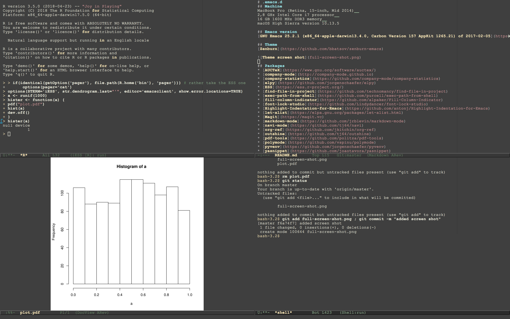

# .emacs.d
## Machine
MacBook Pro (Retina, 15-inch, Mid 2014)  
2,8 GHz Intel Core i7 processor  
16 GB 1600 MHz DDR3 memory  
macOS High Sierra version 10.13.5

## Emacs version
[GNU Emacs 25.2.1 (x86_64-apple-darwin13.4.0, Carbon Version 157 AppKit 1265.21) of 2017-02-05](https://github.com/railwaycat/homebrew-emacsmacport)

## Theme
[Zenburn](https://github.com/bbatsov/zenburn-emacs)



The annoying white line in the middle present in the default setup was removed
with:

```lisp
(set-face-attribute 'vertical-border nil
		    :foreground (face-background 'default))
```

Fringes were hidden by modifing the fringe colour:

```lisp
(set-face-attribute 'fringe nil
		    :foreground (face-foreground 'default)
		    :background (face-background 'default))
```

The font was changed to Courier New:

```lisp
(set-face-font 'default "-outline-Courier New-normal-normal-normal-mono-11-*-*-*-c-*-iso8859-1")
```

Both the menu and tool bars were removed:

```lisp
(tool-bar-mode -1)
(toggle-scroll-bar -1)
```

## Packages
* [AUCTeX](https://www.gnu.org/software/auctex/)
* [company-mode](http://company-mode.github.io)
* [company-statistics](https://github.com/company-mode/company-statistics)
* [elpy](https://github.com/jorgenschaefer/elpy)
* [ESS](https://ess.r-project.org/)
* [find-file-in-project](https://github.com/technomancy/find-file-in-project)
* [exec-path-from-shell](https://github.com/purcell/exec-path-from-shell)
* [fill-column-indicator](https://github.com/alpaker/Fill-Column-Indicator)
* [font-lock-studio](https://github.com/Lindydancer/font-lock-studio)
* [Highlight-Indentation-for-Emacs](https://github.com/antonj/Highlight-Indentation-for-Emacs)
* [let-alist](https://elpa.gnu.org/packages/let-alist.html)
* [Magit](https://magit.vc)
* [markdown-mode](https://github.com/jrblevin/markdown-mode)
* [navi-mode](https://github.com/tj64/navi)
* [org-ref](https://github.com/jkitchin/org-ref)
* [outshine](https://github.com/tj64/outshine)
* [pdf-tools](https://github.com/politza/pdf-tools)
* [polymode](https://github.com/vspinu/polymode)
* [pyvenv](https://github.com/jorgenschaefer/pyvenv)
* [yasnippet](https://github.com/joaotavora/yasnippet)

